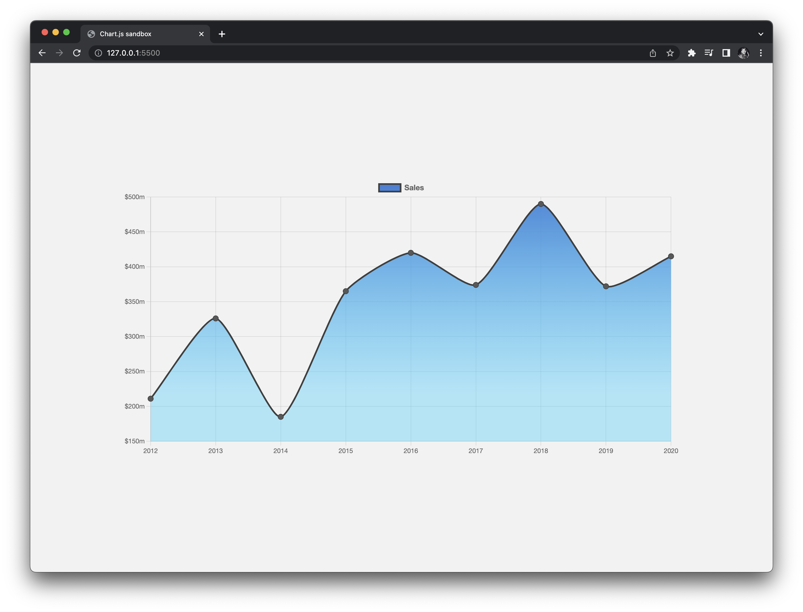

## Chart.js sandbox

> A demonstrated page working with a `chart.js` canvas.



Featuring:

- [chart.js](https://www.chartjs.org/) a simple JS charting library. First, we need to have a `canvas` in our page. It's recommended to give the chart its own container for responsiveness, below a wrapping div is defined. Now that we have a canvas, we can include Chart.js from a CDN.

```html
<body>
  <div class="wrapper">
    <canvas id="chart"></canvas>
  </div>

  <script src="https://cdn.jsdelivr.net/npm/chart.js"></script>
  <script type="module" src="/index.js"></script>
</body>
```

- We add a script that acquires the `chart` canvas element and instantiates new `Chart` that we instance `myChart`, with desired `config`.

```js
const chart = document.querySelector("#chart").getContext("2d");

const data = {
  labels: labels,
  datasets: [
    {
      data: [211, 326, 185, 365, 420, 374, 490, 372, 415],
      label: "Sales",
      fill: true,
      backgroundColor: gradient,
      borderColor: "#3e3e3e",
      pointBackgroundColor: "#585858",
      tension: 0.2,
    },
  ],
};

const config = {
  type: "line",
  data: data,
  options: {
    plugins: {
      tooltip: { padding: 12 },
      legend: {
        labels: {
          // This more specific font property overrides the global property
          font: {
            family: "'Helvetica Neue', 'Helvetica', 'Arial', sans-serif",
            weight: "bold",
            size: 14,
          },
        },
      },
    },
    radius: 5,
    hitRadius: 30,
    hoverRadius: 15,
    responsive: true,
    scales: {
      y: {
        ticks: {
          callback: (value) => `$${value}m`,
        },
      },
    },
    // # https://www.chartjs.org/docs/latest/samples/animations/delay.html
    animation: {
      onComplete: () => (delayed = true),
      delay: (context) => {
        let delay = 0;
        if (context.type === "data" && context.mode === "default" && !delayed) {
          delay = context.dataIndex * 300 + context.datasetIndex * 100;
        }
        return delay;
      },
    },
  },
};

const myChart = new Chart(chart, config);
```

Regards, <br />
Luigi Lupini <br />
<br />
I ❤️ all things (🇮🇹 / 🛵 / ☕️ / 👨‍👩‍👧)<br />
